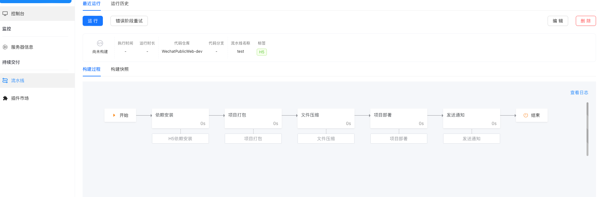
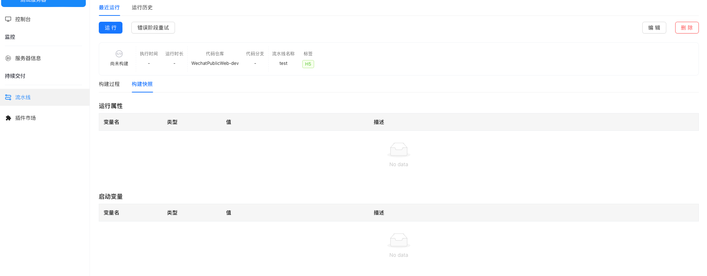
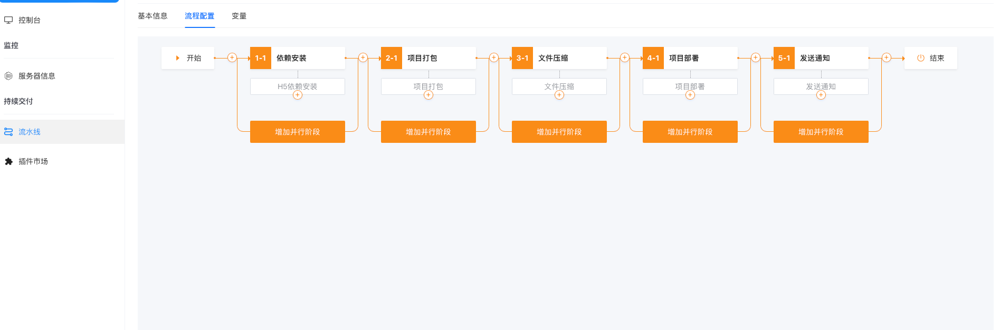
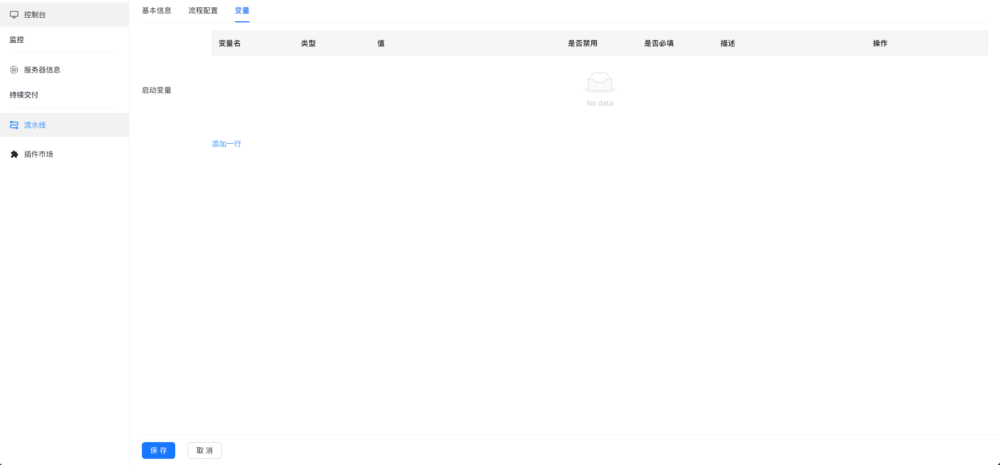

# n-nacos
  `n-nacos` 桌面壳子以及后端服务调用。
  
- [文档](https://beta.tauri.app/guides/)
- [Web端](https://github.com/poohlaha/n-nacos-web)

## 使用
下载 `Web 端` 和 `后端` 放于同一目录下, 然后运行如下命令

```shell
make webInstall
```

## 运行及构建
```shell
make run # 运行
make build # 打包
```

## 检查动态链接库
```shell
otool -L src-tauri/target/release/n-nacos
```

## Rust 插件
- 监控程序
  [n-nacos-tools](https://github.com/poohlaha/monitor)


## H5 插件
- 流水线组件
  [pipeline-draggable](https://github.com/poohlaha/pipeline-draggable)

## 效果







